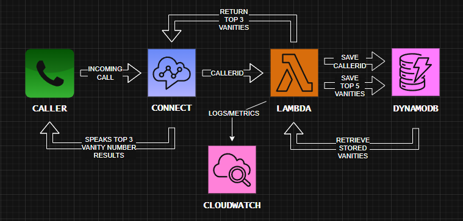
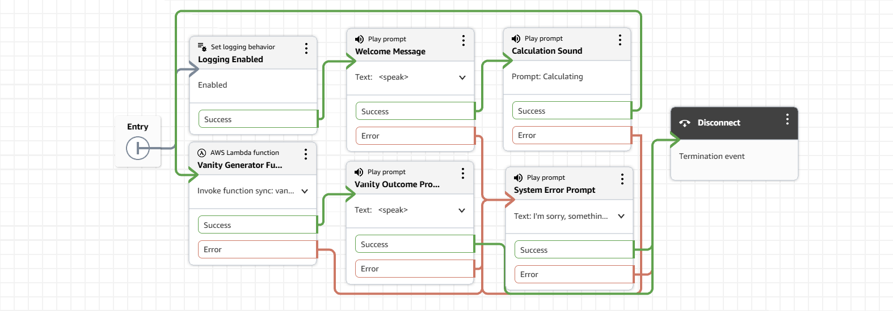

# AWS Vanity Service

A serverless phone number to vanity number conversion service built with AWS Lambda, DynamoDB, and Amazon Connect.

📞 **Try the live demo: 1-833-866-4320**

## 🎯 Project Goals

This project demonstrates a production-ready serverless application that:
- Converts phone numbers into memorable vanity numbers (like 1-800-CALL-NOW)
- Ranks vanity options based on memorability and business value
- Provides real-time voice response through Amazon Connect
- Stores and retrieves vanity numbers efficiently using DynamoDB

## 📚 Documentation

| Document | Purpose |
|----------|---------|
| [Development Journal](./docs/development-journal.md) | Daily progress, challenges faced, and solutions implemented |
| [Architecture Decisions](./docs/architecture.md) | Technical choices and trade-offs explained |
| [Project Roadmap](./docs/roadmap.md) | Implementation phases and requirements checklist |
| [References & Resources](./docs/references.md) | AWS documentation, tutorials, and resources used |

## 🏗️ Architecture Overview



### Components
- **Amazon Connect**: Handles incoming calls and voice interactions
- **AWS Lambda**: Processes phone numbers and generates vanity alternatives
- **DynamoDB**: Stores the best vanity numbers for quick retrieval
- **AWS CDK**: Infrastructure as Code for reproducible deployments

### Connect Flow Example


## ✅ Current Implementation Status

### Completed Features
- **✅ Phone Number Processing**: Robust cleaning and validation with E.164 support
- **✅ Vanity Generation Algorithm**: 13,248-word English dictionary with optimized scoring
- **✅ Production Enhancements**: PII masking, error handling, input validation
- **✅ Real Randomness**: Deduplication and Math.random() for fallback cases
- **✅ TypeScript Safety**: Full type definitions and compilation validation
- **✅ Interactive Testing**: Comprehensive test suite with 90%+ success rate

### Algorithm Performance
- **Success Rate**: 90%+ word match success (vs <1% with business-only dictionary)
- **Example Results**: 555-225-5463 → "555-CALL-463"
- **Fallback Strategy**: Random letter combinations when no words found
- **Sorting**: Score desc → Length desc → Position asc (prioritizes memorable words)

*See [Development Journal](./docs/development-journal.md) for detailed implementation decisions and challenges.*

### Next Steps
- DynamoDB table design and CDK infrastructure
- Lambda-to-DynamoDB integration
- Amazon Connect contact flow setup

*Full roadmap available in [Project Roadmap](./docs/roadmap.md).*

## 📖 What I've Learned

This project has been a deep dive into production-ready serverless development. Key learnings include:

### Technical Skills
- **AWS Lambda Best Practices**: Async/await patterns, proper error handling, PII masking
- **TypeScript in Production**: Interface design, JSON imports, type safety
- **Algorithm Optimization**: O(n) vs O(1) lookups, dictionary pre-processing
- **Production Considerations**: Performance, security, maintainability trade-offs

### Problem-Solving Approach
- **Iterative Development**: Started with simple business dictionary, evolved to comprehensive solution
- **Testing-Driven Decisions**: Built interactive test tools to validate algorithm improvements
- **Performance vs Simplicity**: Chose bundled JSON over external storage for demo simplicity
- **Real-World Thinking**: Implemented PII protection and input validation from the start

### AWS Ecosystem Understanding
- **Lambda Performance**: Cold starts, bundle size optimization, memory considerations
- **Connect Integration**: Event structure, voice response formatting
- **CDK Infrastructure**: TypeScript-based Infrastructure as Code

### Code Quality Insights
- **Documentation Value**: Detailed decision tracking helped explain trade-offs
- **User Experience Focus**: Considered both developer experience and end-user voice interaction

### Connect Integration Lessons
- **Response Format Critical**: Connect requires STRING_MAP - all values must be strings (no arrays/booleans)
- **Manual Setup Required**: Lambda must be explicitly added to Connect instance (not automatic via permissions)
- **Voice Quality**: SSML formatting essential for natural phone number playback

## 🔐 Security & IAM Decisions

### Demo Configuration
For this demo project, we made specific security trade-offs to prioritize development speed and simplicity:

**GitHub OIDC Federation:**
- Replaced static AWS access keys with GitHub OIDC identity provider
- IAM role assumes GitHub Actions identity with repository-specific trust conditions
- No long-lived credentials stored in GitHub secrets

**IAM Permissions:**
- **Demo Choice**: Used `AdministratorAccess` policy for simplicity
- **Reasoning**: Ensures CDK can deploy all required AWS services without debugging least-privilege permissions
- **Trade-off**: Broader permissions than necessary for faster development iteration

### What We Would Do Differently in Production

**Least-Privilege IAM Policy:**
```json
{
  "Version": "2012-10-17",
  "Statement": [
    {
      "Effect": "Allow",
      "Action": [
        "cloudformation:*",
        "lambda:*",
        "dynamodb:*",
        "connect:*",
        "iam:PassRole",
        "iam:CreateRole",
        "iam:AttachRolePolicy",
        "logs:*"
      ],
      "Resource": "*"
    }
  ]
}
```

**Additional Production Security:**
- Separate AWS accounts for dev/staging/production
- Resource-level permissions with specific ARN restrictions
- AWS Config and CloudTrail for compliance monitoring
- Secrets Manager for any application secrets
- VPC endpoints for private service communication

*This demonstrates understanding of security best practices while acknowledging demo constraints.*

*Detailed challenges and solutions documented in [Development Journal](./docs/development-journal.md).*
*Architecture decisions explained in [Architecture Decisions](./docs/architecture.md).*
*Resources and references in [References & Resources](./docs/references.md).*

## 🚀 Getting Started

### Prerequisites
- AWS Account with CLI configured
- Node.js 18+ and npm
- GitHub account (for automated deployment)

### Quick Setup

#### 1. Deploy Infrastructure (Automated via GitHub Actions)
```bash
# Fork/clone the repository
git clone https://github.com/WulfTheGod/AWSVanityService.git
cd AWSVanityService

# Set up GitHub OIDC and variables:
# - Configure AWS OIDC identity provider and IAM role
# - Go to Settings → Secrets and variables → Actions → Variables
# - Add AWS_ROLE_ARN only (Connect setup is manual)

# Deploy automatically by pushing to main
git push origin main
# Monitor deployment in GitHub Actions tab
```

#### 2. Set Up Amazon Connect (Manual)
1. **Create Connect Instance** in AWS Console
2. **Add Lambda Function** to Connect (Critical: Go to Flows → AWS Lambda → Add `vanity-generator`)
3. **Create Contact Flow** manually in Connect designer (see deployment guide for details)
4. **Claim toll-free number** and associate with your manually created flow

*Detailed instructions in [Deployment Guide](./docs/deployment-guide.md)*

### Test Your Service
```bash
# Test Lambda directly
aws lambda invoke \
  --function-name vanity-generator \
  --payload '{"Details":{"ContactData":{"CustomerEndpoint":{"Address":"+15555551234"}}}}' \
  response.json

# Or call the live demo toll-free number: 1-833-866-4320
```

### Current Implementation Status

**✅ Completed Infrastructure:**
- **Modular Lambda Function**: Clean separation of concerns with individual TypeScript modules
- **DynamoDB Table**: Optimized caching with 30-day TTL and proper encryption
- **CDK Stack**: ARM64, structured logging, log retention, and cost-optimized configuration
- **Algorithm**: 90%+ success rate with 13,248-word English dictionary
- **TypeScript Testing**: Comprehensive Jest test suite with proper type checking

**📋 Implementation Highlights:**
- **Modular Architecture**: Each function has its own file for maintainability and testing
- **Type Safety**: Single types.ts file with all interfaces and constants
- **Caching Strategy**: Stores exactly 5 vanity numbers, returns top 3 for Connect
- **Production Features**: PII masking, comprehensive error handling, structured logging
- **Testing**: Jest-based TypeScript tests with coverage reporting
- **Performance**: ARM64 architecture, optimized bundle, 30-second timeout
- **Integration Ready**: CloudFormation outputs configured for Amazon Connect

**🏗️ Project Structure:**
```
├── bin/
│   └── app.ts                   # CDK app entry point
├── lib/
│   └── aws-vanity-service-stack.ts  # CDK infrastructure definition
├── src/
│   ├── data/
│   │   └── english-words.json   # 13,248 optimized English words
│   └── lambda/
│       └── vanity-generator/
│           ├── handler.ts       # Main Lambda handler
│           ├── types.ts         # TypeScript interfaces and constants
│           ├── clean-phone.ts   # Phone number cleaning
│           ├── mask-phone.ts    # Phone number masking for logs
│           ├── find-words.ts    # Word matching algorithm
│           ├── format-vanity.ts # Vanity number formatting
│           ├── random-letters.ts # Random letter generation
│           ├── generate-vanity.ts # Main vanity generation logic
│           ├── get-data.ts      # DynamoDB data retrieval
│           └── save-data.ts     # DynamoDB data storage
├── tests/
│   ├── phone-cleaning.test.ts   # TypeScript Jest tests for input validation
│   ├── keypad-mapping.test.ts   # TypeScript Jest tests for T9 mapping
│   └── vanity-generation.test.ts # TypeScript Jest tests for algorithm
├── scripts/
│   └── generate-english-dictionary.js # Dictionary generation tool
├── connect/
│   └── flow.json               # Amazon Connect contact flow configuration
├── .github/
│   └── workflows/
│       └── deploy.yml          # GitHub Actions CI/CD pipeline
├── jest.config.js              # Jest testing configuration
└── docs/                       # Comprehensive documentation
```

**🔄 Next Phase:**
- Create Amazon Connect instance and claim toll-free number
- Deploy contact flow via CDK with instance ID
- End-to-end demo validation
